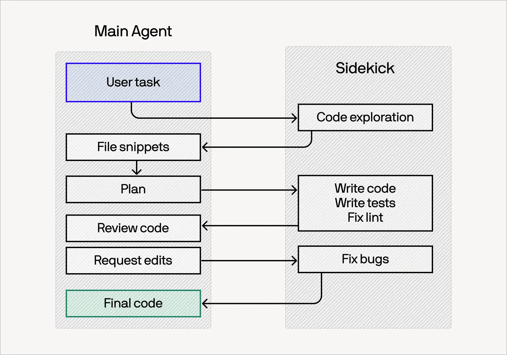

# Fusion Harness

A portable agent skill that applies the lead and sidekick pattern Cognition describes for [Devin Fusion](https://cognition.com/blog/devin-fusion).
It works in Claude Code, Codex, and any agent harness that loads skills and runs shell commands.
This project is independent and not affiliated with Cognition.

## How it works



*Diagram: [Cognition](https://cognition.com/blog/local-fusion).*

The lead is the model you are already talking to. It owns the plan, ambiguity, review, and everything the user sees.
One persistent sidekick explores the code, implements changes, and runs the checks. The two exchange briefs, reports, and feedback, never full conversations.
Each side keeps its own context, so each can reuse its prompt cache across handoffs.
The lead delegates early, writes briefs with requirements and a definition of done, and reviews evidence instead of redoing work.
Fusion assumes a strong sidekick model. Strong sidekicks need less review, which often makes the pair cheaper overall.

## Install

```sh
npx skills add nahuelb/fusion-harness -g -a claude-code -a codex
```

This uses the [skills CLI](https://github.com/vercel-labs/skills). It installs the skill in `~/.agents/skills/fusion` for Codex and links it for Claude Code.
Pick other agents with `-a`, or drop `-g` to install into the current project only.
Start a task with `/fusion <task>` in Claude Code or `$fusion <task>` in Codex. In other harnesses, ask the agent to use the fusion skill.
The first run creates your model file. Update later with `npx skills update fusion -g`.
See [installation](docs/installation.md) for a manual install from a checkout and migration from the earlier Codex plugin.

## Models

The model file is `~/.config/fusion-harness/models.json`, or `$XDG_CONFIG_HOME/fusion-harness/models.json`, or the path in `FUSION_MODELS_FILE`.
It holds one sidekick profile per harness. The lead picks the profile that matches its harness, and `default` covers the rest:

```json
{
  "version": 2,
  "sidekicks": {
    "claude-code": { "transport": "native", "model": "claude-sonnet-5-5", "reasoning_effort": "medium" },
    "codex": { "transport": "native", "model": "gpt-6-sol", "reasoning_effort": "medium" },
    "default": { "transport": "codex-cli", "model": "gpt-6-sol", "reasoning_effort": "medium" }
  }
}
```

| Transport | Sidekick | Resumes with |
| --- | --- | --- |
| `native` | The harness's own subagent, such as a Claude Code agent or a Codex subagent | The harness's message tool |
| `codex-cli` | A Codex CLI session, from any harness | `codex exec resume` |
| `claude-cli` | A Claude Code CLI session, from any harness | `claude -p --resume` |

For a Codex sidekick inside Claude Code, set the `claude-code` profile to `codex-cli`:

```sh
python3 ~/.agents/skills/fusion/scripts/model_config.py set --profile claude-code --transport codex-cli --model gpt-6-sol --effort medium
```

Use exact model IDs and efforts. Claude profiles reject aliases such as `sonnet`, which move to a newer model on release. `null` or `--effort default` uses the transport's default effort.
Claude Code's agent tool cannot set a model ID or effort per call. For the native Claude Code sidekick, `init`, `set`, and `sync` write a generated `~/.claude/agents/fusion-sidekick.md` that pins both.
Claude Code loads that file at session start. A change made during a session applies in the next session, and the lead asks you to restart when its sidekick's settings change. If you edit the JSON by hand, run `model_config.py sync` first.
Other changes take effect at the next handoff without reinstalling anything. A change of transport, model, or effort replaces the sidekick after its running handoff.
An invalid file blocks new handoffs instead of silently selecting another model.

## Limits

The skill is instructions plus small helpers. Nothing enforces delegation, and it does not recreate Devin's model routing or compaction.
A native Claude Code sidekick picks up model changes only in a new session.
Cost savings and quality have not been benchmarked for this skill. Token accounting reads Codex session logs only.

## Development

```sh
python3 scripts/check.py
```

[AGENTS.md](AGENTS.md) holds the contributor rules. [Evaluation](docs/evaluation.md) describes how to compare the skill with a single-agent baseline.

## Sources

- [Devin Fusion: Frontier Performance at 60% Lower Cost](https://cognition.com/blog/devin-fusion)
- [Making Fable Cheaper Than Opus](https://cognition.com/blog/making-fable-cheaper-than-opus)
- [Introducing Fusion in Devin Desktop & CLI](https://cognition.com/blog/local-fusion)
- [Multi-Agents: What's Actually Working](https://cognition.com/blog/multi-agents-working)
- [Devin is now up to 40% more cost-efficient](https://devin.ai/blog/more-efficient-devin)

## License

[MIT](LICENSE). The instruction text is original to this project. The workflow diagram is Cognition's, from their Fusion posts.
